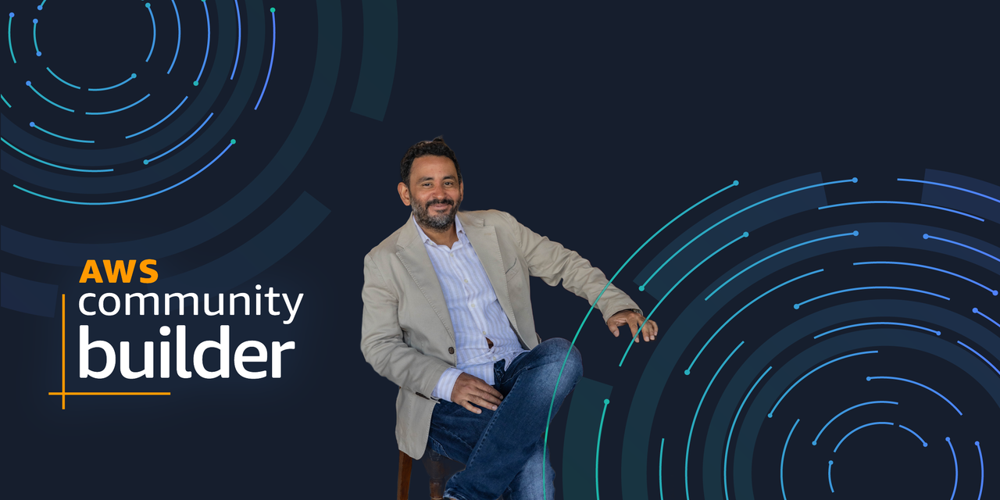
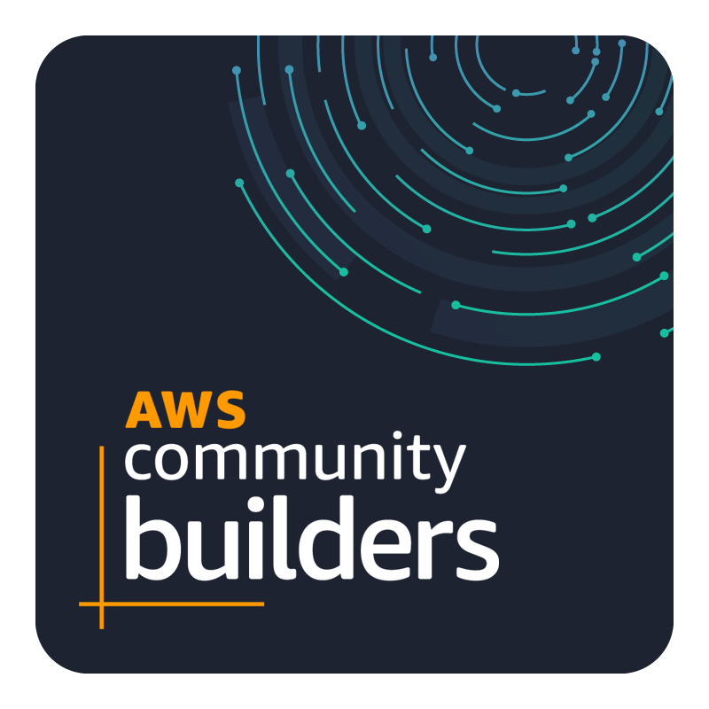

  

# 👋 Hi there, I'm Tarek Cheikh

🎯 **IT Architect | AWS Security Expert | Open Source Builder | AWS Community Builder**

I'm an IT nerd from Paris 🇫🇷 with deep roots in low-level development and cloud architecture. My journey started in the world of **C programming on Linux**, building telco and media systems, and working on **32-bit to 64-bit architecture migrations**.

Since 2014, I've shifted my focus to the **AWS ecosystem**, specializing in:
- 🔐 Cloud security
- 🏗️ Well-Architected cloud systems
- ⚙️ Infrastructure as Code (Terraform, Cloudformation)
- 🧩 DevOps & CI/CD

---

## 🚀 What I Do

- 🧠 Design secure, scalable cloud architectures for startups & enterprises
- 🛠️ Build automation pipelines and serverless apps
- 🧪 Experiment and publish open source AWS + Terraform projects
- 🎙️ Speaker at AWS Summit and other tech conferences
- 🧑‍💼 Founder of [Toc Consulting](https://tocconsulting.fr) — a cloud consulting company

---

## 📌 Featured Projects

- [`awsmap`](https://github.com/TocConsulting/awsmap): Fast, comprehensive tool for mapping and inventorying AWS resources across 140+ services and all regions
    
- [`cryptex-cli`](https://github.com/TocConsulting/cryptex): Enterprise-grade CLI password generator with AWS Secrets Manager, HashiCorp Vault, and OS Keychain integrations
    
- [`s3-security-scanner`](https://github.com/TocConsulting/s3-security-scanner): Comprehensive AWS S3 security scanner with compliance mapping for CIS, PCI-DSS, HIPAA, SOC 2, ISO & GDPR
    
- [`iam-activity-tracker`](https://github.com/TocConsulting/iam-activity-tracker): Serverless AWS IAM activity monitoring with real-time alerts and CloudTrail analytics
    
- [`cognito-api`](https://github.com/TocConsulting/cognito-api): Secure user authentication system using Cognito + Terraform
   
- [`fileshare-serverless`](https://github.com/TocConsulting/small-file-sharing): File sharing app with AWS Lambda + S3
   
- [`aws-helper-scripts`](https://github.com/TocConsulting/aws-helper-scripts): Comprehensive AWS Security & Cost Optimization Toolkit
   

---

## 🛠️ Technologies I Use

---

## 📈 GitHub Stats

  

---

## 🏆 Achievements & Metrics

- 🌟 **20+ years** in IT architecture and cloud computing
- ☁️ **50+ AWS projects** deployed in production
- 🚀 **Migrated 15+ legacy systems** to cloud-native architectures
- 🎯 **99.9% uptime** maintained across client infrastructures
- 📚 **20+ technical articles** published on cloud security, Software programming and Linux
- 🎤 **Speaker at tech conferences** including AWS Summit Paris
- 🏅 **AWS Community Builder** — recognized by AWS for contributions to the community

---

## 🎓 Certifications & Recognition

  
  
  
  

- 🌐 Cisco CCNA Certified

---

## 🎯 Current Focus

- 🤖 **AI/ML Integration** with AWS services (Bedrock, SageMaker)
- 🔒 **Zero Trust Security** architectures in the cloud
- 🌐 **Multi-cloud strategies** and hybrid solutions
- 📖 **Learning:** Advanced Kubernetes security patterns

---

## 📝 Recent Articles

- 🏅 [I Just Became an AWS Community Builder ... And I Owe It to You](https://medium.com/aws-in-plain-english/i-just-became-an-aws-community-builder-and-i-owe-it-to-you-80e122f226d6)
- 🧠 [awsmap v1.5.0: Your AWS Inventory Now Has a Brain](https://aws.plainenglish.io/awsmap-v1-5-0-your-aws-inventory-now-has-a-brain-2c253f9b23cd)
- 🗺️ [awsmap, Find Everything Running in Your AWS Account](https://aws.plainenglish.io/awsmap-find-everything-running-in-your-aws-account-3294c5326baa)
- 🔐 [Episode 5: Load Balancer Security Auditor — SSL, Protocols, and Public Exposure](https://aws.plainenglish.io/episode-5-load-balancer-security-auditor-ssl-protocols-and-public-exposure-b7f97c4bee1c)
- 🔑 [Cryptex — Because openssl rand -base64 32 Gets Old Fast](https://aws.plainenglish.io/cryptex-because-openssl-rand-base64-32-gets-old-fast-d9f1200c5a12)
- 🌐 [The Hidden Backbone of the Internet: Why S3 Security Should Keep You Up at Night](https://aws.plainenglish.io/the-hidden-backbone-of-the-internet-why-s3-security-should-keep-you-up-at-night-4dd8d8d67b90)

---

## 📫 Let's Connect

